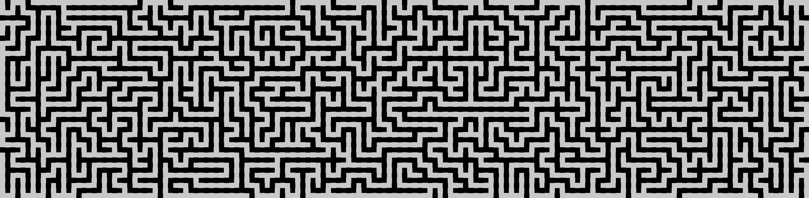

# Maze-Generator-V2
Generate an image file that contains a randomly generated maze



Change the size of each pixel at line 76

```py
75 | def translate_grid(self, grid):
76 |     pixelSize = 20 # Set the size of each pixel (in pixels lol)
77 |     size = (grid.shape[1] * pixelSize * 2 - pixelSize, # Define the size of the canvas
78 |             grid.shape[0] * pixelSize * 2 - pixelSize)
```
